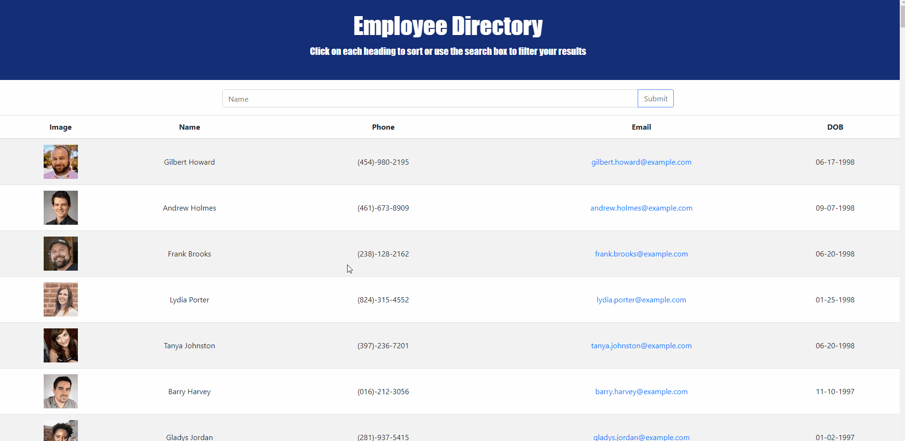

## employee-directory [](https://opensource.org/licenses/MIT)

## Links
- Deployed Link: https://ktlnn.github.io/employee-directory/  
- API used: https://randomuser.me/api/?results=200&nat=us

## Table of Contents
- [User Story](#userstory)
- [Business Context](#businesscontext)
- [How Employee Directory Works](#howemployeedirectoryworks)
- [Installation](#installation)
- [Webpage Screenshots](#screenshots)
- [Questions](#questions)


## User Story
```
AS AN employee or manager 
I WANT to be able to view my entire employee directory at once 
SO THAT I have quick access to their information.
```

## Business Context
An employee or manager would benefit greatly from being able to view non-sensitive data about other employees. It would be particularly helpful to be able to filter employees by name.

## How Employee Directory Works 
Employee Directory is an application that allows the user to view their entire employee directory at once. The employees' data is neatly organized in a table and only contains non-sensitive information. The user is able to filter the employee directory by using the search bar to narrow down the table and find the employee the user wants. Each table header also includes an onClick event that allows the user to sort the employees' data ascendingly or descendingly.

## Installation
Employee Directory is able to be used by clicking on the "Deployed Link" in links or the repository can be cloned. If the repository is cloned, run an "npm install" or "yarn add" in your terminal in order to download the packages that are required to allow this application to work. Once all packages are installed, run an "npm start" or "yarn start" to open Employee Directory in your browser. 
 
## Screenshots



## Questions
If you have any questions about this application, feel free to email: ktlnn.nguyen@gmail.com
